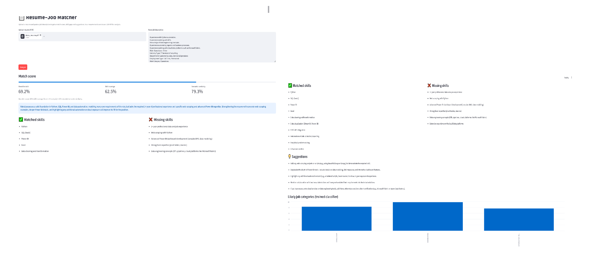
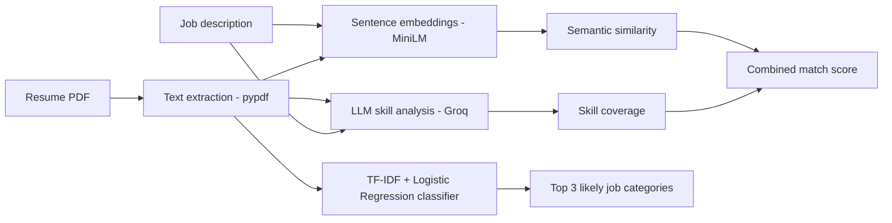
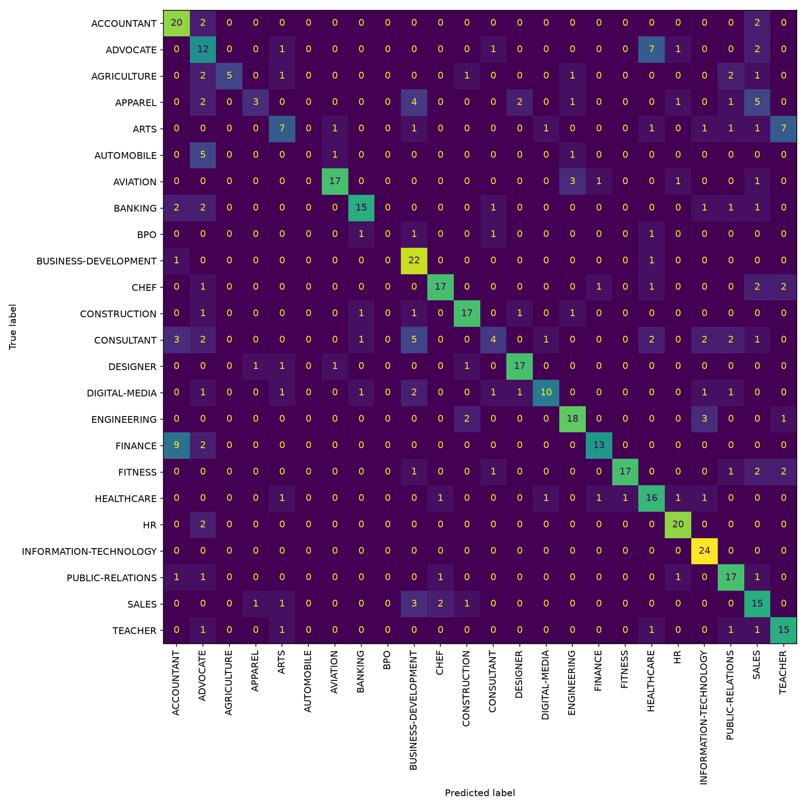

# 📄 Resume–Job Matcher

Upload a resume (PDF) and paste a job description. The app returns a match score, matched and missing skills, improvement suggestions, and the job categories the resume most resembles.

**🔗 Live demo:** coming soon



## Features

- PDF resume parsing with input validation (empty, scanned or non-resume files are rejected with a clear message)
- Combined match score from semantic similarity and LLM-based skill analysis
- Matched skills, missing skills and concrete suggestions to improve the resume
- A classifier I trained myself that predicts which job family the resume resembles

## How it works



1. **Semantic similarity:** the resume and job description are embedded with `all-MiniLM-L6-v2`. Long texts are split into chunks and averaged, then compared with cosine similarity.
2. **Skill analysis:** an LLM (`openai/gpt-oss-120b` on Groq) returns matched skills, missing skills and suggestions as structured JSON, with a retry if the JSON is invalid.
3. **Match score:** a heuristic, `60% skill coverage + 40% rescaled semantic similarity`.
4. **Category classifier:** a TF-IDF + Logistic Regression model trained on labelled resumes, used as a hint about the job family.

## Classifier results

- **Dataset:** Kaggle *Resume Dataset* (24 job categories)
- **Size:** 2,484 rows, 2,482 after deduplication
- **Split:** 80/20, stratified
- **Accuracy: 64.6%** across 24 classes (random baseline is about 4%)

Many categories overlap in content (for example HR and Business-Development), which explains most of the errors.



## Limitations

- The match score is a **heuristic**, not a validated measure of hiring fit. The weights (60/40) and the similarity rescaling bounds (30 to 75) were chosen by hand.
- Skill extraction depends on the LLM, so results can vary slightly between runs.
- The classifier is moderately accurate and its confidence is often low, so the category output is a hint, not a verdict.
- Scanned (image-only) PDFs are not supported because there is no OCR.

## Privacy

Uploaded resumes are processed in memory and are not stored by this app. The extracted text is sent to the Groq API for analysis.

## Run locally

```bash
git clone https://github.com/anamikaapandeyy/resume-matcher.git
cd resume-matcher
python -m venv venv
venv\Scripts\activate        # Mac/Linux: source venv/bin/activate
pip install -r requirements.txt
```

Create a `.env` file containing:

```
GROQ_API_KEY=your_key_here
```

Then run:

```bash
streamlit run app.py
```

To retrain the classifier, run `pip install -r requirements-train.txt`, download the Kaggle *Resume Dataset* into `data/Resume.csv`, and run `python train.py`.

## Project structure

```
resume-matcher/
├── app.py                 # Streamlit UI
├── matcher.py             # PDF parsing, embeddings, LLM feedback, scoring
├── train.py               # Trains and evaluates the classifier
├── utils.py               # Shared text cleaning
├── model.joblib           # Trained classifier
├── vectorizer.joblib      # Fitted TF-IDF vectorizer
├── confusion_matrix.png   # Evaluation plot
├── requirements.txt
└── requirements-train.txt
```

## Tech stack

Python, Streamlit, scikit-learn, sentence-transformers, Groq API, pypdf